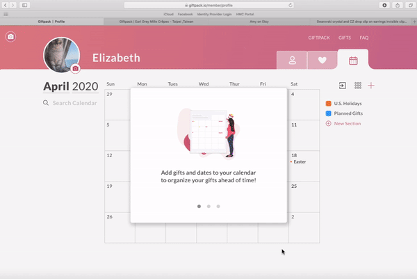
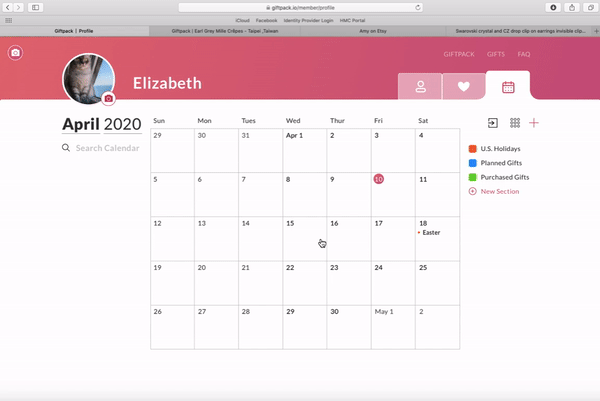

## Giftpack
---

 
In **Spring 2020** I started as a **UI/UX design intern** at **Giftpack**. 
 
Giftpack is a startup with its headquarters in Taipei that improves the gifting experience consumer to consumer and business to business through the power of AI and customization. I really enjoyed working at Giftpack, it gaves me the opportunity to explore the startup space, and to have much more control over the impact and projects I developed. Working with Giftpackers primarily based in Asia, I learned to appreciate the flexibility and difficulties of working remotely across timezones. Despite it all, I learned so much about design, and about building a family remotely. Here are the main projects I did:
  

--- 

### 1. Adding Calendar features to Giftpack
 

 
 

 
 

 
 

### 2. Revising "Secret Messages" feature 
 

 
 

 
 

#### 3. Redesigned the UX flow for the trial process of Giftpack AI

#### 4. Researched and developed UX flows for Giftpack users (Google Chrome, Slack, etc)

#### 5. Adding Favorite features to Giftpack (Shipping in Progress)

Check out [Giftpack](giftpack.io)!
