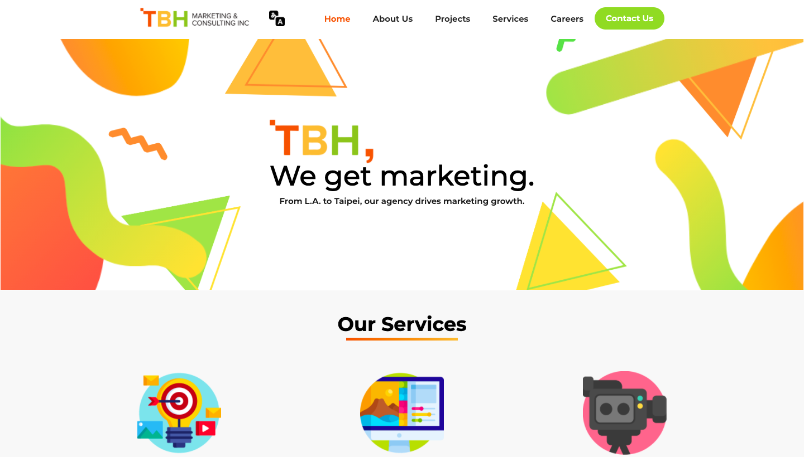
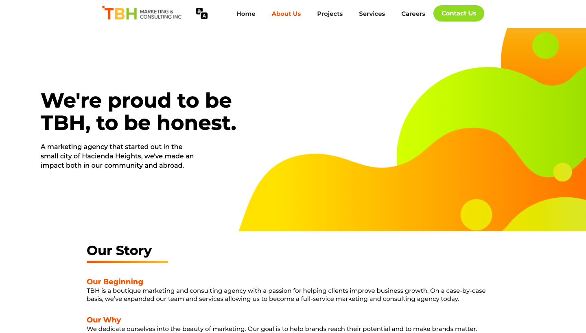

## TBH Marketing
---

**Summer 2019** I joined **TBH Marketing** as a **project manager intern**.
 

---

### 1. Built website using Webflow/Wordpress

Using design principles, I completely redesigned TBH Marketing to reflect the motto and brightness of the TBH Marketing team and office.

#### Before

#### After

  

### 2. Built insurance website aimed towards millennials using Wix

I worked as a project manager on a team of interns to develop an insurance website aimed towards millennials. We researched health insurance policies, ways to develop calculators to determine health plans, did market research, and competitor analysis.

 

#### 3. Built chatbot using Tensorflow
#### 4. Was hosted on TBH Marketing's podcast

 

For more details see [TBH Marketing](tbh-marketing.com).
