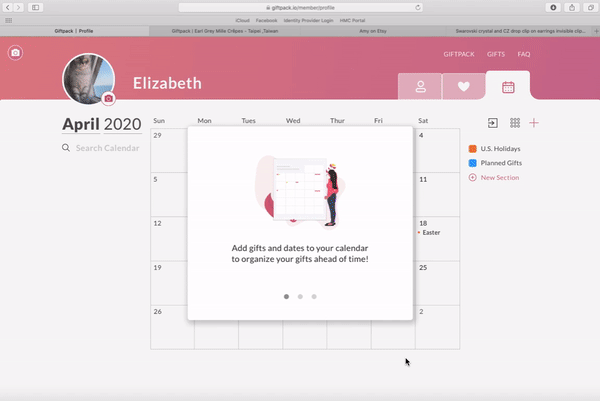
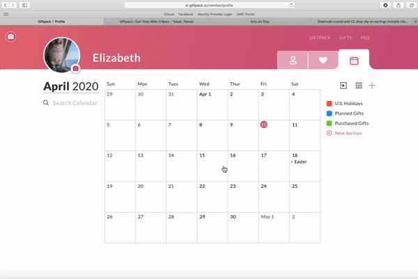

## Giftpack
---

 
In **Spring 2020** I started as a **UI/UX design intern** at **Giftpack**. 
  
Giftpack is a startup with its headquarters in Taipei that improves the gifting experience consumer to consumer and business to business through the power of AI and customization. Working at Giftpack gave me the opportunity to explore the startup space, and to have much more control over the impact and projects I developed. Because Giftpack is primarily based in Asia, I learned to appreciate the flexibility and difficulties of working remotely across timezones. Despite it all, I learned so much about UI/UX design, and about building a virtual community. 
  

  
Here are the main projects I did:
  

--- 

### 1. Adding Calendar features to Giftpack
 

 
 

 
 
 

### 2. Revising "Secret Messages" feature 
 

 
 

 
 

#### 3. Redesigned the UX flow for the trial process of Giftpack AI

#### 4. Researched and developed UX flows for Giftpack users by interviewing target audience (Google Chrome, Slack, etc)

#### 5. Adding Favorite features to Giftpack (Shipping in Progress)

Check out [Giftpack](giftpack.io)!
