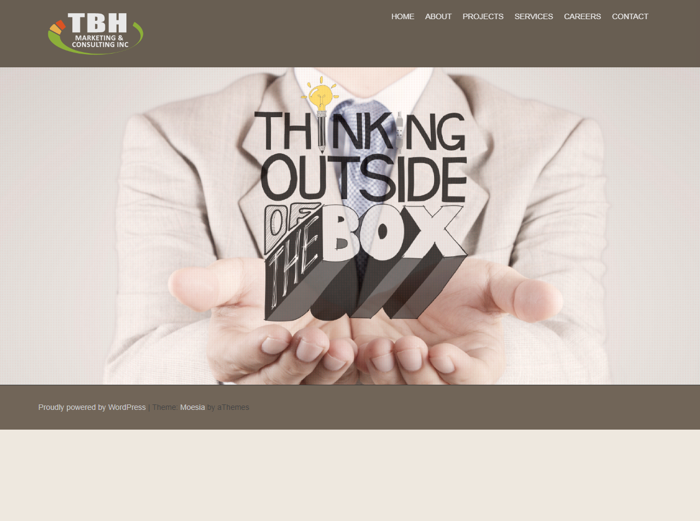
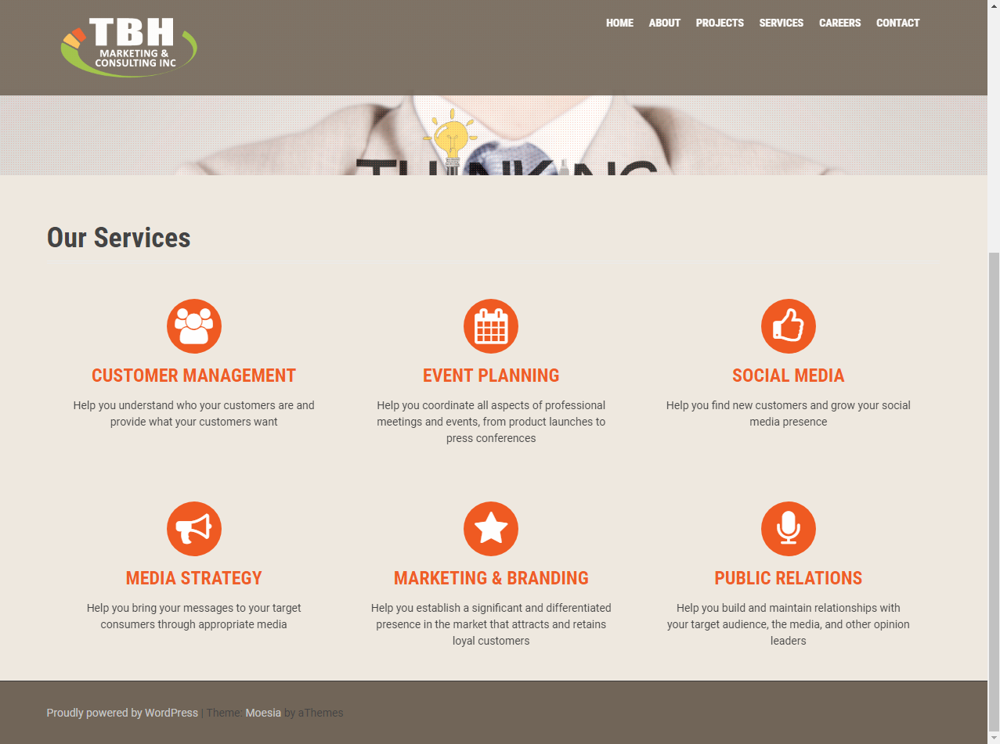
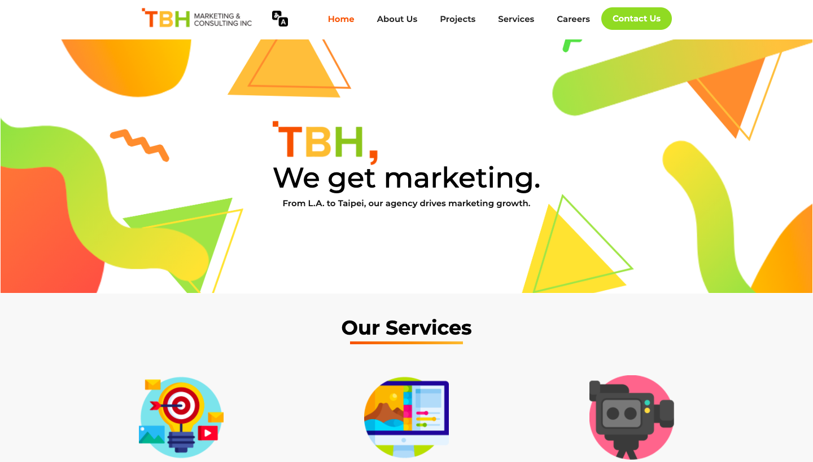
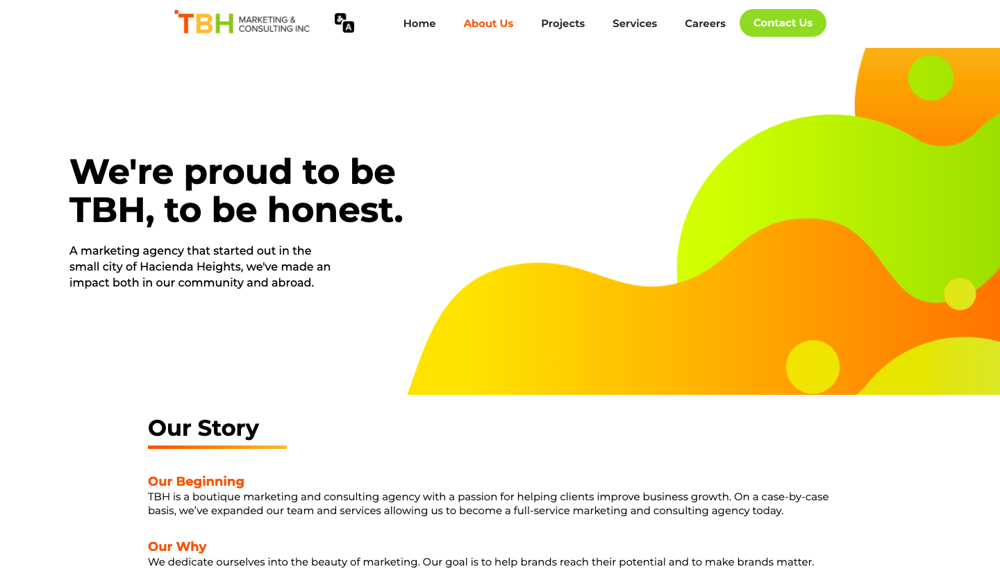

## TBH Marketing
---

**Summer 2019** I joined **TBH Marketing** as a **project manager intern**. I took on various projects during my time as an intern, but my main project was rebuidling TBH Marketing's website for their needs. Interning at TBH Marketing right before college and having projects to dip my toes into the realm of software engineering / computer science encouraged me to eventually become a computer science major.
 

---

### 1. Built website using Webflow/Wordpress

Using design principles, I completely redesigned TBH Marketing to reflect the motto and brightness of the TBH Marketing team and office. Surveying the team which was mostly made of young Asian American millennials, I built a website which the team felt more represented by. In addition, I provided a guide to ensure they would be able to maintain the website and update any content necessary.

#### Previous Website

#### Current Website

  

### 2. Built insurance website aimed towards millennials using Wix

I worked as a project manager on a team of interns to develop an insurance website aimed towards millennials. With no background in insurance, we started off by researching health insurance policies, ways to develop calculators to determine health plans, while conducting market research and competitor analysis. Finally, we looked deeper into our audience and ourselves, attempting to understand how to make insurance an appealing topic to millennials and understand what a younger generation prioritizes in their insurance (spoiler alert: it's convenience and simplicity).

 

### 3. Built chatbot using Tensorflow

As part of building an insurance website aimed towards millennials, the prospect of providing convenience and simplicity through a chatbot was a truly enticing idea. Unfortunatley, I was only able to partially build a chatbot to answer basic questions about health insurance and collect consumer information for a quote (from a human associate), though my end-goal was to create a chatbot which could provide automatic quotes using APIs. 

 

For more details see [TBH Marketing](tbh-marketing.com).
